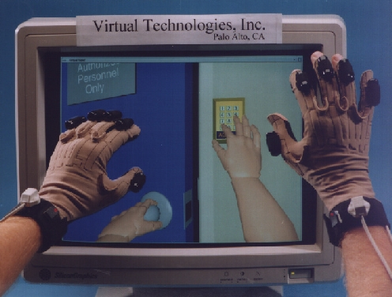

# CyberGlove for C++

This package is a simple development library for C++ to use CyberGlove
on IRIX and WIN32 platforms. 



## Setup

To use the package, you have to make a library from following four
source files at first.

- cyberglove.h
- cyberglove.cpp
- serial.h
- serial.cpp

Use the following compiler flags to create the library.

COMPILER FLAG | PURPOSE
---|---
WIN32 | Support for Windows9x//NT platform.
SGI | Support for IRIX

## Class Overview

### CyberGlove Class

```
class CCyberGlove : public CSerial
{
public:
    CCyberGlove(char *device, int speed);
   ~CCyberGlove();
    int GetNSensors(void)
    void UpdateData();
    int GetData(int i);
};
```

#### CCyberGlove(char \*device, int speed)

- device : Specifies a string of the serial port. You can use the platform independent defines SERIAL1 or SERIAL2 that are defined in "serial.h"
- speed : Specifies the baud rate that is a communication speed with a Polhemuse device.

The constructor an instance that is used to communicate with a CyberGlove device.

#### int GetNSensors(void)

The method returns a number of sensors that the CyberGlove has.

#### void UpdataData(void)

The method gets new sensor records of the CyberGolove.

#### int GetData(int sensorNumber)

The method returns a raw data of the specified sensor. The valid range of the sensorNumber is from 0 to the value returned by GetNSensors() minus 1.

### Revision

Revision | Date | Note
---|---|---
1.0 | 1999/05/14 | The first release.

### License

This library is provided "AS IS". Licenser disclaims all warranties,
including but not limited to, all express or implied warranties of
merchant ability and fitness for a particular purpose. Everyone can use
the library for commerce or personal purposes free.
